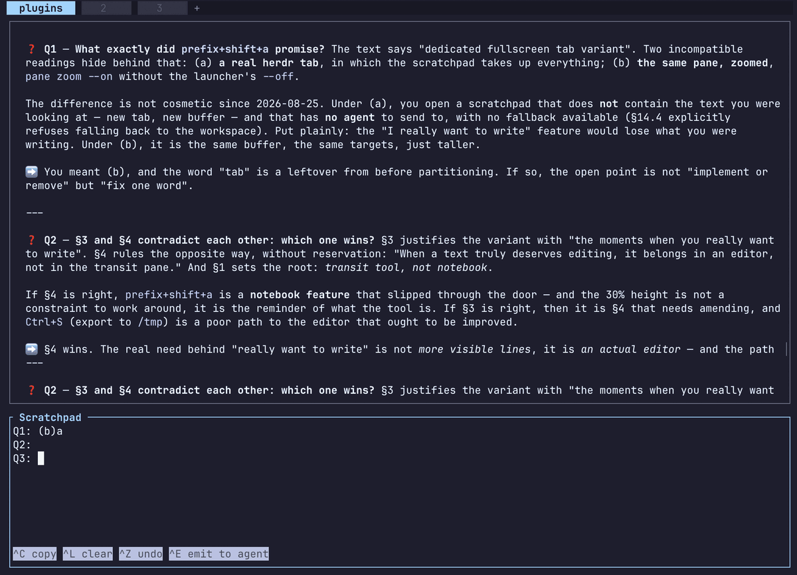

<div align="center">

# herdr-scratchpad

### The scratchpad for Herdr.

A [herdr](https://herdr.dev) pane docked at the bottom of your tab. Paste into
it, pick things back up, wipe. It saves itself as plain text and comes back
after a restart.




</div>

## What it's for

Mostly: **writing the prompt before sending it.** An agent's input box is a bad
place to compose ten lines — Enter submits, editing is awkward, and a
half-finished thought sits one keystroke away from being sent. Write it here
instead, reread it, and `Ctrl+E` drops it into the agent's box *without*
pressing Enter for you. You land in front of it and submit when you mean to.

The rest is what a scratch buffer has always been for: a stack trace to keep
while you change tabs, a command you retype twice a day, three lines of output
you want on your laptop's clipboard even though herdr runs on a box across the
room.

**One buffer per tab.** A tab's scratchpad has its own text and talks to that
tab's agents, not to the ones next door. What you see, what you edit and what
you talk to all line up.

---

## Install

```
herdr plugin install vjeantet/herdr-scratchpad
```

That clones the repo, shows you what it's about to install, and **asks before
doing anything**. On yes it runs the manifest's build step, then enables the
plugin. Pass `--yes` to skip the prompt — required when stdin isn't a terminal.

**No toolchain needed on the common platforms.** The build step downloads the
prebuilt binary published for the version you're installing and your platform,
checks its SHA-256, and installs it. Five targets are published: macOS on Apple
silicon and Intel, Linux on x86_64, aarch64 and armv7 — the Linux ones are
static musl, so they start on an old distribution too (a Raspberry Pi on
Debian 12 included).

Anything else — another platform, no release for that version, a download or
checksum that doesn't check out — falls back to `cargo build --release` on your
machine, which is what this step always did. **That path wants Rust ≥ 1.88**:
the crate uses let-chains, which the 1.85 of edition 2024 doesn't have. Nothing
else either way: no system libraries, no runtime.

Check it works before touching any config:

```
herdr plugin action invoke herdr-scratchpad.open-scratchpad
```

The pane should appear docked at the bottom of the current tab, focused, ready
to type in. That command is the whole plugin — the keybinding below just puts
it on a key.

Removing it is symmetric: `herdr plugin uninstall herdr-scratchpad`.
`herdr plugin disable herdr-scratchpad` keeps it installed but idle.

## Put it on a key

The plugin ships no keybinding of its own — herdr keeps those in your config,
where you can see every key you've spent in one place. Add four lines to
`~/.config/herdr/config.toml` (same path on macOS and Linux, unless you set
`XDG_CONFIG_HOME`):

```toml
[[keys.command]]
key = "prefix+a"
type = "plugin_action"
command = "herdr-scratchpad.open-scratchpad"
description = "toggle scratchpad"
```

`prefix` is herdr's prefix key, `ctrl+b` out of the box — so `prefix+a` means
**Ctrl+B, then A**. Pick another letter if `a` is taken; `herdr config check`
tells you if the file is malformed, and `prefix+?` lists what's already bound.

**You don't have to restart herdr**: `prefix+shift+r` reloads `config.toml` in
the running server, session and all.

Then `prefix+a` opens the pane docked at the bottom, focuses it if it's already
open, and closes it if it's focused — one key for all three. From inside the
pane, `Esc` closes it outright. A pane left dead by a server restart gets
replaced rather than duplicated.

## The first minute

1. **`prefix+a`.** The pane opens across the bottom of the tab, cursor already
   in it.
2. **Type, or paste.** It's a plain text area, always editable — there's no
   mode to enter first. Your terminal's usual paste (`Ctrl+Shift+V`, `Cmd+V`)
   works and arrives as one block, however many lines it is.
3. **`Ctrl+E`.** The text lands in your agent's input box and you land there
   with it. Nothing was submitted: reread it, then press Enter yourself.
4. **`prefix+a`** again for an empty scratchpad — or `Ctrl+Z` first, if you
   want that text back.

Nothing to save, nothing to name, nothing to clean up afterwards.

## Keys

| Key | Button | Action |
| --- | --- | --- |
| `Ctrl+E` | `^E emit to agent` | drops the text into an agent, wipes, and switches to it |
| `Ctrl+N` | `→ claude·p3` | next agent in the tab (from two on) |
| `Ctrl+C` | `^C copy` | copies the selection — or everything — to your own machine's clipboard |
| `Ctrl+L` | `^L clear` | wipes, no confirmation |
| `Ctrl+S` | — | writes `/tmp/herdr-scratchpad-$HERDR_TAB_ID.txt` |
| `Ctrl+Z` | `^Z undo` | brings back the last wiped or emitted content |
| `Shift`+any cursor move, mouse drag | — | select text (typing replaces it, `Backspace` deletes it) |
| `Ctrl`+arrows, `Alt`+arrows, `Alt+b` / `Alt+f` | — | jump a word (use `Option` on macOS, where `Ctrl`+arrows belongs to Mission Control) |
| `Alt+Backspace`, `Ctrl+Backspace` | — | delete the word to the left |
| `Ctrl+Home` / `Ctrl+End` | — | start / end of the text |
| `Esc` | — | drops the selection if there is one, closes the pane otherwise |

These are the combinations your fingers already know, each with its usual
meaning. The buttons in the bottom bar do the same thing on click or touch —
except `Ctrl+S` and `Esc`, which have none: one drops a file you'll go read
somewhere else, the other closes the pane. Neither is a finger gesture. The
hint on an empty scratchpad is where both are taught.

`Ctrl+C` **copies here, it doesn't interrupt** — the pane runs in raw mode, and
there's no job in it to kill anyway. Same for `Ctrl+S`, which writes a file
rather than freezing the terminal, and `Ctrl+Z`, which undoes rather than
suspending.

**`Esc` closes the pane**, following the convention of herdr's TUI plugins:
Esc backs out one step, and closing is the last step. The only step above it is
a selection — Esc drops it first, and closes on the next press. Nothing is
lost — the text is saved on the way out and kept per tab, so `prefix+a` brings
it back exactly as you left it. That's also why it asks for no confirmation.

`prefix+a` closes it too, mirroring the gesture that opened it — and it's what
reopens the pane from the agent `Ctrl+E` just dropped you on. There is still no
`Ctrl+Q`: on a pane you want permanent, a letter spent on quitting only ever
closes it by accident.

## Emit to an agent

`Ctrl+E` **drops** the text into a herdr agent's input box. It does not send
it: **no Enter is typed**. You land on the agent, reread, and submit yourself —
or wipe it. Dropping into a busy agent is harmless, the text waits in the box.

A ten-line prompt arrives as **a single paste**, not line by line: herdr wraps
it in a bracketed paste.

Once the drop is confirmed the scratchpad wipes itself and **focus moves to the
agent** — you land in front of your text, ready to reread and send. The wipe is
a *move*, not a copy: `Ctrl+Z` catches it like any other wipe, once you come
back with `prefix+a`. **If the emit fails, nothing is wiped and nothing
switches**: that's what makes the error inconsequential.

Targets are the agents of the **pane's own tab**, and only those — no fallback
to the workspace, no last-used, no first-come. A destination you can't explain
from what's on screen is worse than no destination.

- **No agent in the tab** — the `^E` button isn't drawn at all, rather than
  drawn to refuse. The scratchpad is then a local notepad, which is a normal
  way to use it. `Ctrl+E` says `no agent`.
- **One agent** — `^E` is there; no target area, since it would only repeat
  what the button already says.
- **Two or more** — the destination shows permanently next to the button,
  `→ claude·p3`: the agent, then the tail of its `pane_id`, which is what tells
  two `claude` sessions apart. That readout is the guard rail, and it replaces
  any confirmation. `Ctrl+N` or a click on the area moves to the next agent.

## The two-way channel

This is the most useful property, and it comes for free.

State lives in `$HERDR_PLUGIN_STATE_DIR/scratchpad-$HERDR_TAB_ID.txt`, in the
clear. The file **is** the text, no escaping. `HERDR_TAB_ID` is present in an
agent's pane like in any other: it composes the path itself, without being
told. So, from an agent's pane:

```bash
D=~/.local/state/herdr/plugins/herdr-scratchpad

# read what's in my tab's scratchpad
cat "$D/scratchpad-$HERDR_TAB_ID.txt"

# put something in it
git log --oneline -20 > "$D/scratchpad-$HERDR_TAB_ID.txt"
```

The pane watches the file and reloads on its own when it changes — unless it
has unsaved keystrokes, in which case what you type wins. An agent writing that
file makes text appear in front of you; what you paste into the pane, it can
read.

Several scratchpad panes can be open at once, one per tab: each has its own
file, so its own text. To move text from one tab to another, `Ctrl+C` or
`Ctrl+S` — an explicit gesture.

The key is frozen when the pane opens: a scratchpad moved to another tab
(`pane move`) keeps its origin tab's buffer and targets.

## Copy, and the 192 KB limit

Copying goes through **OSC 52**: the text travels up to the clipboard of the
terminal you're connected *from*, not of the machine herdr runs on. That's what
you want over SSH, and it works on a machine with no display server.

herdr caps clipboard writes at **192 KB** (`MAX_CLIPBOARD_BYTES`). Past that,
`Ctrl+C` refuses explicitly and points you at `Ctrl+S` — rather than letting
you paste emptiness somewhere else.

A **click places the cursor**; a **drag selects**; the wheel scrolls. With a
selection, `Ctrl+C` copies just that — without one it copies **everything**,
so the no-thinking path stays what it was. Selecting also works from the
keyboard: `Shift` on any cursor move, word jumps included.

`Shift`+drag still selects natively, like in any pane: herdr reserves
`Shift`+mouse for the terminal, and the plugin doesn't touch it. That
selection belongs to your terminal emulator; the one above belongs to the
scratchpad — typing replaces it, `Backspace` deletes it, `Esc` drops it.

## Export

`Ctrl+S` writes `/tmp/herdr-scratchpad-$HERDR_TAB_ID.txt` — fixed path for a
tab, overwritten, shown for 3 seconds in the bar. A tab therefore never
clobbers another one's snapshot.

It isn't "getting the text out" (the state file already does that): it's
**freezing a snapshot**. The state file moves on its own; this one doesn't.

## What it deliberately isn't

A notebook. There's **no rendered markdown and no preview mode** — no modes at
all, in fact: the text area is always editable, and there's no key to enter
before you can type. Nothing here is meant to be kept and reread; you use it
and you wipe it.

That's also why the state is a plain `.txt` rather than a structured file, and
why the buffer is scoped to a tab rather than filed away somewhere: it exists
to move text, mostly the few inches between your head and an agent's input box.

## Hacking on it

From a checkout, `herdr plugin link .` registers the working tree in place —
no copy, no reinstall, edits land where herdr looks.

```
cargo build --release
cargo test
cargo clippy --all-targets -- -D warnings
```

All three green before shipping. One catch worth knowing: **close and reopen
the pane after every `cargo build --release`**. An already-open scratchpad keeps
running the old binary, so you end up testing the behaviour you just changed.

**Cutting a release.** Bump the version in `Cargo.toml` *and* in
`herdr-plugin.toml` — they must agree with each other and with the tag, or
`.github/workflows/release.yml` stops there rather than publish binaries no
install could ever find. Then push a `v<version>` tag: the workflow drafts a
release, has each target upload its own binary and `.sha256` into it, and
undrafts only once the whole matrix is green. Until that last step every asset
URL 404s, and installs simply build from source.

The match is by **version, not by commit**. A checkout ahead of the last tag
still installs that tag's binary; the install prints a note saying so, read from
the `COMMIT` marker the release publishes.

`DESIGN.md` holds the what and the why; `CLAUDE.md` the how and the traps.
Both are in French.

## License

MIT.
